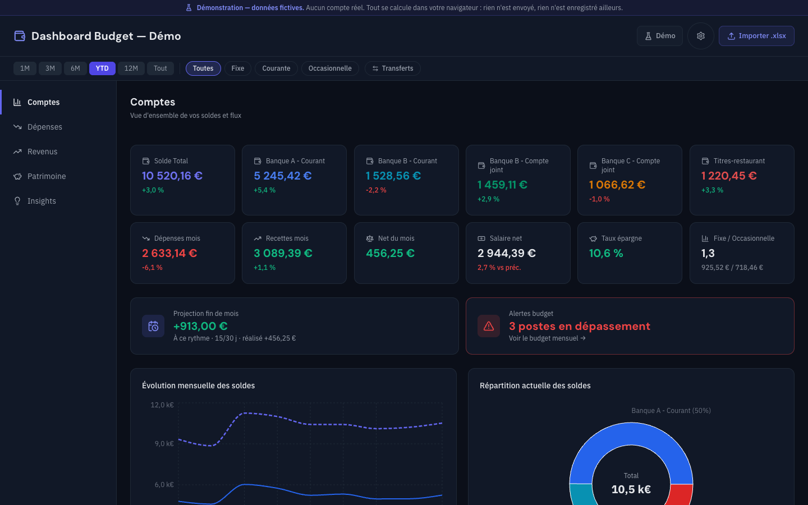
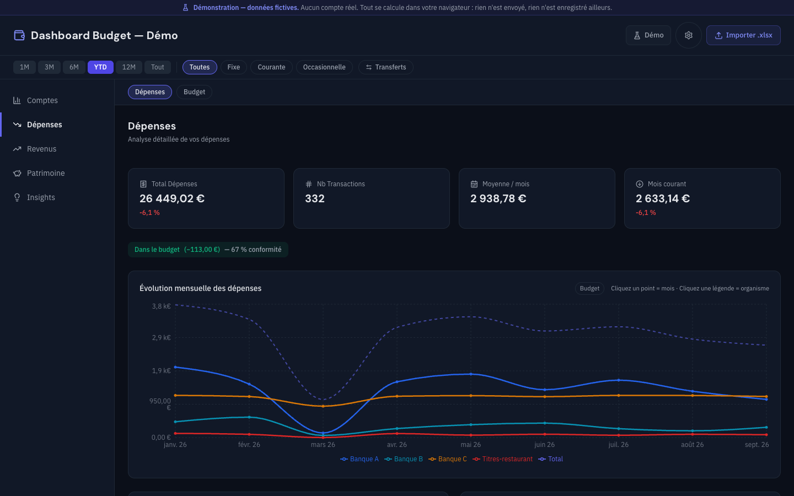
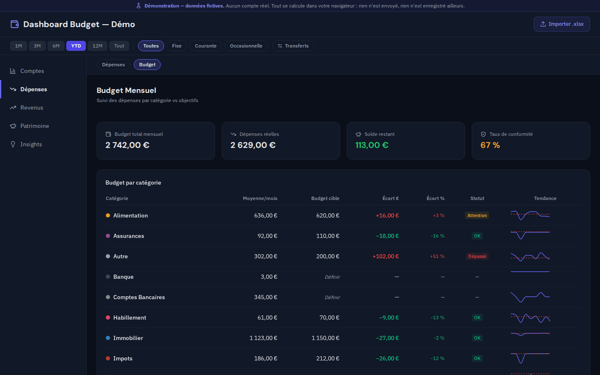
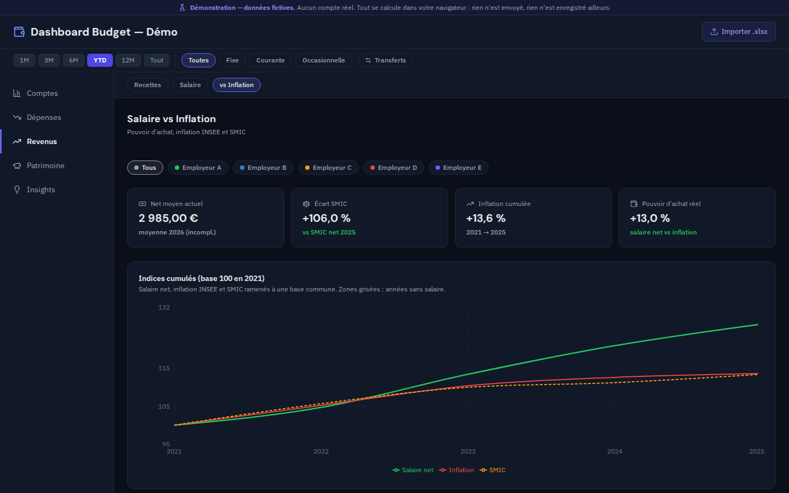
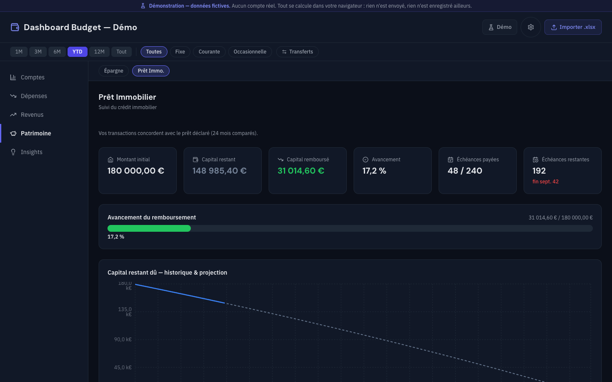

# Dashboard Budget — Démo

> **Démonstration publique. Toutes les données sont fictives.**
> Aucun compte, aucun salaire, aucun prêt réel. Les chiffres sont produits par
> un générateur à graine fixe : [`scripts/generate-demo-data.mjs`](scripts/generate-demo-data.mjs).

**➜ Voir la démonstration : https://dashboard-budget-demo.pages.dev/**

Version publique et statique d'un tableau de bord de finances personnelles.
React 18, TypeScript, Vite, Tailwind, Zustand, Recharts. 508 tests.



---

## Le problème

Un tableur de suivi budgétaire finit toujours par savoir beaucoup de choses et
n'en montrer aucune. Mille sept cents lignes de transactions, cinq comptes,
plusieurs années de bulletins de paie, un prêt immobilier — et pour répondre à
« est-ce que je dépense plus qu'avant en alimentation ? », il faut construire
un tableau croisé dynamique de plus.

Trois questions reviennent, et aucune n'a de réponse immédiate dans un
tableur :

- **Où part l'argent**, par classe de dépense, par catégorie, par compte, et
  comment cela évolue d'un mois sur l'autre.
- **Est-ce que je tiens mes objectifs**, poste par poste, sur une moyenne qui
  ait un sens.
- **Est-ce que mon salaire suit l'inflation**, sur dix ans, face à une
  référence publique.

Ce tableau de bord répond à ces trois questions à partir d'un seul classeur
Excel, sans ressaisie.

---

## Le modèle de données

### Quatre niveaux de catégorisation

Une dépense n'a pas une catégorie mais quatre, et elles ne servent pas à la
même chose.

| Niveau | Champ | Ce qu'il répond | Exemple |
|---|---|---|---|
| 1 | `cat1` | Cette dépense est-elle **compressible** ? | Dépense Fixe / Courante / Occasionnelle |
| 2 | `cat2` | **Quel poste** de budget ? | Alimentation, Transport, Immobilier |
| 3 | `cat3` | **Chez qui**, ou pour quoi ? | Supermarché, Cantine, Pharmacie |
| 4 | `cat4` | Détail libre | — |

Le niveau 1 est celui qui compte pour décider. Un loyer et un restaurant sont
deux « dépenses », mais un seul des deux se négocie. Les objectifs de budget
se posent au niveau 2, parce que c'est l'échelle à laquelle un poste reste
comparable d'un mois sur l'autre.

### Les comptes partagés

Un foyer ne tient pas ses comptes comme une personne seule. Trois mécanismes
coexistent dans le modèle :

- **Compte à solde propre** — ses crédits et débits font son solde.
- **Part commune** — une dépense partagée, dont seule la quote-part est
  imputée. Le montant est divisé, pas la transaction.
- **Compte lié** — alimenter un compte joint depuis le compte principal sort
  de l'un pour entrer dans l'autre. Sans cette règle, le total du patrimoine
  augmenterait à chaque virement interne.

Le vocabulaire des comptes vit dans un module unique,
[`src/config/accounts.ts`](src/config/accounts.ts), où chaque compte porte un
**identifiant stable** distinct de son **libellé affiché**. C'est la condition
pour qu'un renommage ne casse rien — et la marche d'escalier vers un
paramétrage complet par le fichier source.

### La traçabilité

Deux informations voyagent avec les données, et elles évitent chacune une
classe d'erreur :

**L'origine** — `api`, `static`, `upload` ou `inconnue`. Elle est décidée par
le chemin qui a **réussi**, jamais par celui qui a été tenté. Avant, un repli
silencieux sur les fichiers du site se présentait comme une réponse du
serveur. Et quand personne ne déclare rien, la valeur est `inconnue` : mieux
vaut dire qu'on ne sait pas qu'afficher une origine fausse.

**La couverture temporelle** — la période que la source embrasse, distincte
des dates où il s'est passé quelque chose. La règle complète est écrite dans
[`docs/CONTRAT_COUVERTURE.md`](docs/CONTRAT_COUVERTURE.md), avant le code.

---

## L'architecture de la version réelle

L'application dont cette démonstration est issue est un **trois tiers**. Le
dépôt public ne contient que le premier.


Le point d'architecture le plus utile est le **tier 2**. Le navigateur n'a
jamais le jeton d'authentification : il appelle une adresse de son propre
domaine, et c'est la fonction de périphérie qui ajoute l'en-tête
d'autorisation côté serveur. Le bundle client n'embarque aucun secret — ce qui
se vérifie, et se vérifie automatiquement (voir plus bas).

### Pourquoi cette démonstration est statique

Publier l'API aurait demandé de l'assainir, de l'authentifier autrement et de
l'exposer à Internet pour un site de démonstration. Le rapport entre le risque
et ce que cela aurait montré de plus n'est pas bon.

Le dépôt public contient donc **le tier 1 seul**, et les données viennent de
fichiers JSON servis avec le site.

Le chemin API n'a pas été laissé « au cas où » : il a été **retiré**. Un repli
qui ne replie sur rien n'est pas une sécurité, c'est un appel voué à l'échec à
chaque ouverture, visible dans l'onglet Réseau, et qui contredirait le bandeau
affiché en haut de l'écran.

**Vérifié en navigateur réel** — chargement des 9 pages en 1440 px puis en
412 px :

```
Requêtes réseau distinctes : 50
  vers le site      : 50
  vers l'extérieur  : 0
Erreurs console : 0
```

Les polices sont embarquées et servies par le site. Un site qui promet
« aucun service tiers » ne peut pas faire partir l'adresse IP de ses visiteurs
chez un fournisseur de polices au premier octet de CSS.

---

## La méthode de travail

C'est la partie de ce projet dont je suis le plus satisfait, et elle tient en
une phrase : **mesurer avant, mesurer après, et accepter que la mesure
contredise le plan.**

### Le diagnostic invalidé par la mesure

Le plan du lot « densité des cartes d'indicateurs » prévoyait de passer en
colonne unique sur mobile et d'abréger les montants. Avant d'écrire une ligne,
un indicateur a été construit pour mesurer le **taux de remplissage** des
cartes — la largeur naturelle du texte rapportée à la largeur utile.

Verdict : à 412 px, **aucune carte n'était cassée**, avec 15 % de marge sur le
pire cas. La colonne unique coûtait environ 500 px de hauteur sur une page,
pour un défaut inexistant.

Le contenu du lot a été refait sur la mesure. Ce qui a été retenu tient en
**deux lignes de CSS couvrant les 52 cartes de 8 pages** : remplissage maximal
85 % → 69 % à 412 px, et 101 % → 83 % à 360 px, où cinq valeurs cassées
repassent à zéro.

### 6 cibles sur 9

Le lot responsive s'était fixé neuf cibles chiffrées. La mesure de contrôle en
donne **six atteintes, deux manquées, une non concluante**. Elles sont
publiées telles quelles :

| Cible | Avant | Après |
|---|---|---|
| Pages à défilement horizontal | 6 / 9 | **0 / 9** |
| Débordement horizontal | 522 px | **0 px** |
| Cibles tactiles sous 44 px (pire page) | 24 | **1** |
| Graphiques à largeur figée | plusieurs | **0** (17 graphiques à 346 px) |
| Nœuds de texte sous 12 px | — | 39 — *cible ≤ 20, manquée* |
| Police minimale | — | 10 px — *cible ≥ 11, manquée* |
| Zone sûre en bas d'écran | — | *non mesurable en émulation* |

Une cible non concluante reste non concluante. L'émulation renvoie 0 pour la
zone sûre d'un téléphone : c'est une limite de l'outil, pas un résultat.

### Les indicateurs mentent plus souvent que le code

Trois lots consécutifs ont trouvé un **indicateur en panne**, pas un défaut du
produit. Un compteur de retours à la ligne comptait des nœuds de texte au lieu
de lignes, et annonçait des ruptures inexistantes — un correctif avait été
écrit, puis retiré faute de fondement.

D'où la règle : **avant d'exploiter une sortie, on vérifie l'instrument.**

### Le bug des 15 jours

Un mois n'entrait dans la moyenne budgétaire que s'il comptait au moins 15
jours distincts porteurs d'une transaction. Deux choses sans rapport : un mois
où l'on ne paie que trois prélèvements est un mois complet.

Conséquence : quand aucun mois ne passait le seuil, la moyenne valait 0 — donc
« conforme » face à n'importe quel objectif. **900 € dépensés, objectif 500 €,
et l'écran affichait 100 % de conformité, en vert.**

Le test rouge a été écrit et montré **avant** le correctif.

### Un tiret plutôt qu'un 100 % trompeur

La correction précédente a imposé une règle qui traverse maintenant tout le
code : **quand une valeur n'est pas calculable, elle vaut `null` — jamais 0,
jamais 100 %.**

Le type l'impose, et c'est ainsi que deux autres défauts sont apparus :

- La page Dépenses testait `solde >= 0`. En JavaScript, `null >= 0` vaut
  `true` : avec un solde inconnu, la page annonçait « Dans le budget », en
  vert.
- La page Comptes affichait « Aucun dépassement », en vert, quand rien
  n'était calculable.

Chaque écran concerné affiche désormais un message qui **explique pourquoi**
la valeur manque, et non un tiret muet.

### Ce que cela donne en tests et en contrôles

| | |
|---|---|
| Tests | **508**, 44 fichiers |
| Chaîne complète | lint → types → tests → build → contrôle de publication |
| Durée | environ 86 s |
| CI | tout ce qui précède, plus gitleaks et un contrôle de fraîcheur des données |

Le **contrôle de publication** refuse de laisser passer un nom réel, un
fichier inattendu dans le build, une extension interdite ou un secret. Deux
listes se complètent : la noire attrape ce qu'on sait nommer, la blanche
attrape ce à quoi personne n'a pensé.

Il a lui-même révélé deux choses. D'abord qu'un outil de détection de secrets
écarte par défaut les clés d'exemple de la documentation — un test bâti
dessus conclut à tort que l'outil ne marche pas. Ensuite, et c'est mesuré,
qu'il détecte par **mots-clés anglais** :

```
export const API_TOKEN = "v1.0-9f3a…"   → détecté
export const JETON     = "v1.0-9f3a…"   → NON détecté
```

Même valeur, même fichier. Seul le nom change. Un projet écrit en français a
donc un angle mort, comblé par une règle maison.

---

## Les écrans

| | |
|---|---|
|  |  |
| **Dépenses** — répartition et évolution | **Budget mensuel** — objectifs par poste |
|  |  |
| **Salaire vs inflation** — pouvoir d'achat | **Prêt immobilier** — amortissement et simulation |

Les neuf écrans, en 1440 px et en 412 px, sont dans
[`docs/captures/`](docs/captures/). Toutes les captures sont prises sur cette
démonstration, avec ses données.

---

## Les données de la démonstration

Deux natures, volontairement séparées :

**Inventées** — `transactions.json`, `salary.json`, `config.json`,
`budgets.json`. Libellés, marchands, employeurs, villes et montants sont
écrits dans le générateur, jamais dérivés de données réelles.

**Réelles et publiques** — `references.json` : inflation INSEE et SMIC, avec
leur source et leur date de consultation. Comparer un salaire à une inflation
imaginaire n'apprendrait rien à personne.

Le jeu couvre 25 mois et contient trois cas choisis pour être visibles :

- un **mois intérieur sans aucune dépense** — il vaut 0 €, il compte dans les
  moyennes, il n'est pas « absent » ;
- deux **mois volontairement incomplets** ;
- un **dernier mois partiel**, donc exclu des moyennes, comme le veut la règle
  de couverture.

Le générateur est à **graine fixe** : deux exécutions produisent des fichiers
identiques, octet pour octet. La CI le rejoue et échoue si le résultat diffère
de ce qui est versionné.

---

## Démarrer

```bash
npm ci        # installation reproductible
npm run dev   # http://localhost:5173
npm run check # lint + types + tests + build + contrôle de publication
```

Aucun fichier `.env` : ni API, ni jeton, ni secret.

| Commande | Rôle |
|---|---|
| `npm run donnees` | régénère les cinq fichiers de `public/data/` |
| `npm run verif` | contrôle de publication — **bloquant** |
| `npm run preview` | sert le build sur `http://localhost:4173` |

---

## Journal des lots

| Lot | Objet | État |
|---|---|---|
| **0** | Base fiable — commandes reproductibles, origine des données, contrat de couverture, bug des 15 jours corrigé | ✅ |
| **A.0–A.2** | Validation, inventaire des données personnelles, vocabulaire neutre dans un module unique | ✅ |
| **A.3** | Générateur de données fictives à graine fixe | ✅ |
| **A.4** | Mode statique — plus aucun appel serveur, polices embarquées, bandeau permanent | ✅ |
| **A.5** | Assainissement et contrôle de publication bloquant | ✅ |
| **A.6** | Intégration continue | ✅ |
| **A.7** | Ce document et les captures | ✅ |
| **B** | Format de fichier public, validation d'import, navigation conditionnelle | à venir |
| **C** | Paramétrage complet par le fichier source | à venir |
| **D** | Recette de diffusion | à venir |

---

## Limites connues

Elles sont écrites parce qu'elles existent, pas parce qu'elles sont
confortables.

**Les comptes ne viennent pas encore du fichier.** Ils sont déclarés dans
`src/config/accounts.ts`. Surtout, les **règles de solde sont écrites compte
par compte** : ajouter un compte ne lui donne pas de solde — il vaudra zéro,
sera absent du graphique **et du total**, sans erreur ni message. C'est la
limite la plus dangereuse de cet état, parce qu'elle est silencieuse. Détail
dans [`docs/LIMITES_PARAMETRAGE.md`](docs/LIMITES_PARAMETRAGE.md).

**La couverture temporelle est inférée, pas mesurée.** Faute de dates de
relevé dans le format actuel, le premier et le dernier mois des données sont
écartés des moyennes. Un relevé qui commence effectivement le 1er du mois perd
ce mois sans raison. C'est une supposition prudente, assumée : une moyenne
fausse ne se voit pas, une moyenne absente se voit.

**Le lecteur Excel est celui d'un classeur précis.** En-têtes en ligne 18,
colonnes lues par position. Un format public et documenté est l'objet du lot B.

**Le mois courant de la démonstration est figé** à septembre 2026. C'est le
prix du déterminisme du générateur : un jeu qui bouge à chaque exécution
rendrait tout écart de test ininterprétable.

**Le SMIC net porte une incohérence héritée** de la base de référence : les
années postérieures à 2019 utilisent la dernière revalorisation de l'année,
sauf 2024, qui utilise celle du 1er janvier. Écart de 27,60 €. Signalé plutôt
que corrigé en silence.

---

## Licences

Code sous licence MIT.
Polices DM Sans et IBM Plex Sans sous SIL Open Font License 1.1 — voir
[`src/assets/fonts/PROVENANCE.md`](src/assets/fonts/PROVENANCE.md).
